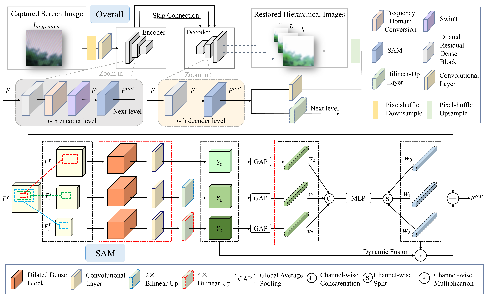
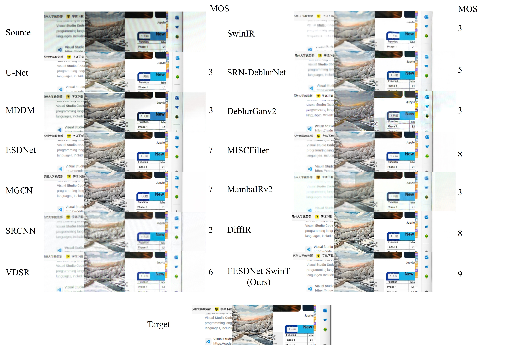

# Comprehensive Image Restoration for Robot-Assisted PC-Side UI Automated Testing using FESDNet-SwinT

## :hourglass_flowing_sand: To Do
- [x] Release training code
- [x] Release testing code
- [x] Release dataset
- [x] Release pre-trained models

## Introduction
We propose a novel deep learning-based image restoration framework, FESDNet-SwinT, tailored for robot-assisted automated testing of PC-side user interfaces (UIs). The method addresses the compounded challenges of screen image degradation, including moiré patterns, low resolution, and blurring. By integrating high-frequency enhancement modules with Swin Transformer architectures, FESDNet-SwinT effectively restores fine details and structural fidelity. We introduce PC-Restore, a large-scale dataset comprising 94,675 degraded/clean image pairs, specifically designed to empower models with robust generalization capabilities for real-world UI scenarios. Furthermore, we establish an Optical Character Recognition (OCR)-based evaluation method to objectively assess restoration performance, particularly in text-rich UI images. Experimental results demonstrate that FESDNet-SwinT achieves state-of-the-art performance, with PSNR of 28.34, SSIM of 0.933, LPIPS of 0.044, and OCR accuracy of 90.4%. This comprehensive solution ensures high-quality image restoration while maintaining real-time performance, making it highly suitable for diverse UI automated testing applications.

The image captured by industrial cameras for UI automated testing often exhibits issues, e.g., low resolution, moiré patterns, and blur.

<p align="center">  </p>

## Environments

First you have to make sure that you have installed all dependencies. To do so, you can create an anaconda environment called pc using

```cmd
conda create -n pc python=3.9.18
conda activate pc
```

Install PyTorch and torchvision, specifying the version for CUDA 11.8, and install other dependencies listed in requirements.txt using

```cmd
pip install torch==2.2.0 torchvision==0.17.0 --index-url https://download.pytorch.org/whl/cu118
pip install -r requirements.txt
```

Our implementation has been trained on NVIDIA 4080 GPU with cuda 11.8.

## Train and Test

Once you have installed all dependencies, you can try a quick test:

### 1. Download our dataset (Original images of training set and validation set)

We provide our PC-Restore dataset, which can be downloaded through the following links:

[Baidu Cloud Link](https://pan.baidu.com/s/12DqsU2CS7KTFmJ0c-hyeCg) Extraction Code: 9s3j


### 2. Download our pre-trained model

We provide pre-trained models on PC-Restore datasets, which can be downloaded through the following links:

[Baidu Cloud Link](https://pan.baidu.com/s/1ZPqJdgWGtkZY10nNeeQ_Ig) Extraction Code: upcp 

After downloading the pre-trained model, you can place it in the `./out_dir/FESDNet_SwinT/exp_light/net_checkpoints/` directory.

### 3. Train our dataset:

Before running the `train.py`, make sure to modify the TRAIN_DATASET and TEST_DATASET paths in the pc_restore.yaml file to point to the correct dataset locations on your system. To train a model from scratch, simply run:

```cmd
python train.py --config ./configs/pc_restore.yaml
```

### 4. Test our dataset:

To evaluate our dataset, simply run:

```cmd
python test.py --config ./configs/pc_restore.yaml
```

### 5. Test the images in a folder

Change the configuration file `./demo_config/demo.yaml`, and then simply run:

```cmd
python demo_test.py --config ./demo_config/demo.yaml
```

## Network architectures

<p align="center">  </p>


## Results

### Quantitative results

| Method                            | Field                       | PSNR↑ | SSIM↑ | LPIPS↓ | Time↓ | Mult-Adds↓ | Params↓ | MOS↑ | OCR Accuracy↑ |
| ------------------------------------- | --------- | --------- | ---------- | --------------- |------------| ----------------- | ----------------- | ------------------------------------- | ------------------------------------- |
| Camera-Captured Image                 | -               | 14.22     | 0.550     | 0.469      | -     | -          | -               | -        | 0.652             |
| U-Net      | Image Segmentation | 22.75     | 0.875     | 0.061      | 2.35 ms | 48.36 G  | 28.95 M | 3        | 0.520             |
| MDDM            | Image Demoiréing | 19.13     | 0.766     | 0.240      | 14.16 ms | 27.65 G  | 3.58 M     | 5        | 0.523             |
| ESDNet | Image Demoiréing | 27.07 | 0.918 | 0.051 | 12.58 ms | 17.63 G  | 5.93 M | 7 | 0.895 |
| MGCN | Image Demoiréing | 24.93 | 0.911 | 0.045 | 25.61 ms | 53.64 G  | 5.66 M | 8 | 0.884 |
| SRCNN | Image Super-Resolution          | 19.30     | 0.822     | 0.335      | 0.23 ms | 4.55 G   | 0.07 M      | 3        | 0.250             |
| VDSR        | Image Super-Resolution          | 18.11     | 0.715     | 0.143      | 0.33 ms | 7.52 G     | 0.11 M      | 4        | 0.696             |
| SwinIR | Image Super-Resolution | 19.64 | 0.765 | 0.271 | 64.64 ms | 57.99 G  | 0.91 M | 4 | 0.783 |
| SRN-DeblurNet    | Image Deblurring | 22.56     | 0.861     | 0.157      | 14.91 ms | 108.66 G  | 10.25 M    | 4        | 0.438             |
| DeblurGanv2 | Image Deblurring | 16.65     | 0.658     | 0.172      | 20.65 ms | 25.61 G  | 5.09 M | 4        | 0.389             |
| MISCFilter | Image Deblurring | 24.31 | 0.875 | 0.082 | 53.42 ms | 2.34 G   | 15.99 M | 8 | 0.891 |
| FESDNet-SwinT (Ours)            | Comprehensive Image Restoration | 28.34 | 0.933 | 0.044  | 17.59 ms | 19.10 G  | 6.52 M     | 9    | 0.904         |

### Subjective results

<p align="center">  </p>

## References

```BibTex
@inproceedings{ronneberger2015u, % U-Net
  title={U-net: Convolutional networks for biomedical image segmentation},
  author={Ronneberger, Olaf and Fischer, Philipp and Brox, Thomas},
  booktitle={Medical image computing and computer-assisted intervention--MICCAI 2015: 18th international conference, Munich, Germany, October 5-9, 2015, proceedings, part III 18},
  pages={234--241},
  year={2015},
  organization={Springer}
}
@inproceedings{cheng2019multi, % MDDM
  title={Multi-scale dynamic feature encoding network for image demoir{\'e}ing},
  author={Cheng, Xi and Fu, Zhenyong and Yang, Jian},
  booktitle={2019 IEEE/CVF International Conference on Computer Vision Workshop (ICCVW)},
  pages={3486--3493},
  year={2019},
  organization={IEEE}
}
@inproceedings{yu2022towards, % ESDNet
  title={Towards efficient and scale-robust ultra-high-definition image demoir{\'e}ing},
  author={Yu, Xin and Dai, Peng and Li, Wenbo and Ma, Lan and Shen, Jiajun and Li, Jia and Qi, Xiaojuan},
  booktitle={European Conference on Computer Vision},
  pages={646--662},
  year={2022},
  organization={Springer}
}
@article{nguyen2023multiscale, % MGCN
  title={Multiscale coarse-to-fine guided screenshot demoir{\'e}ing},
  author={Nguyen, Duong Hai and Lee, Se-Ho and Lee, Chul},
  journal={IEEE Signal Processing Letters},
  volume={30},
  pages={898--902},
  year={2023},
  publisher={IEEE}
}
@inproceedings{dong2014learning, % SRCNN
  title={Learning a deep convolutional network for image super-resolution},
  author={Dong, Chao and Loy, Chen Change and He, Kaiming and Tang, Xiaoou},
  booktitle={Computer Vision--ECCV 2014: 13th European Conference, Zurich, Switzerland, September 6-12, 2014, Proceedings, Part IV 13},
  pages={184--199},
  year={2014},
  organization={Springer}
}
@inproceedings{kim2016accurate, % VDSR
  title={Accurate image super-resolution using very deep convolutional networks},
  author={Kim, Jiwon and Lee, Jung Kwon and Lee, Kyoung Mu},
  booktitle={Proceedings of the IEEE conference on computer vision and pattern recognition},
  pages={1646--1654},
  year={2016}
}
@inproceedings{liang2021swinir, % SwinIR
  title={Swinir: Image restoration using swin transformer},
  author={Liang, Jingyun and Cao, Jiezhang and Sun, Guolei and Zhang, Kai and Van Gool, Luc and Timofte, Radu},
  booktitle={Proceedings of the IEEE/CVF international conference on computer vision},
  pages={1833--1844},
  year={2021}
}
@inproceedings{tao2018scale, % SRN-DeblurNet
  title={Scale-recurrent network for deep image deblurring},
  author={Tao, Xin and Gao, Hongyun and Shen, Xiaoyong and Wang, Jue and Jia, Jiaya},
  booktitle={Proceedings of the IEEE conference on computer vision and pattern recognition},
  pages={8174--8182},
  year={2018}
}
@inproceedings{kupyn2019deblurgan, % DeblurGanv2
  title={Deblurgan-v2: Deblurring (orders-of-magnitude) faster and better},
  author={Kupyn, Orest and Martyniuk, Tetiana and Wu, Junru and Wang, Zhangyang},
  booktitle={Proceedings of the IEEE/CVF international conference on computer vision},
  pages={8878--8887},
  year={2019}
}
@inproceedings{liu2024motion, % MISCFilter
  title={Motion-adaptive separable collaborative filters for blind motion deblurring},
  author={Liu, Chengxu and Wang, Xuan and Xu, Xiangyu and Tian, Ruhao and Li, Shuai and Qian, Xueming and Yang, Ming-Hsuan},
  booktitle={Proceedings of the IEEE/CVF Conference on Computer Vision and Pattern Recognition},
  pages={25595--25605},
  year={2024}
}
```

## Acknowledgements

This model is based on the work of [Xin Yu et al.](https://github.com/CVMI-Lab/UHDM), whose contributions greatly inspired and influenced the improvements made in this project. Special thanks for their original work and ideas.

## Contact

If you have any questions, you can email me (yunxzhu37@163.com).
